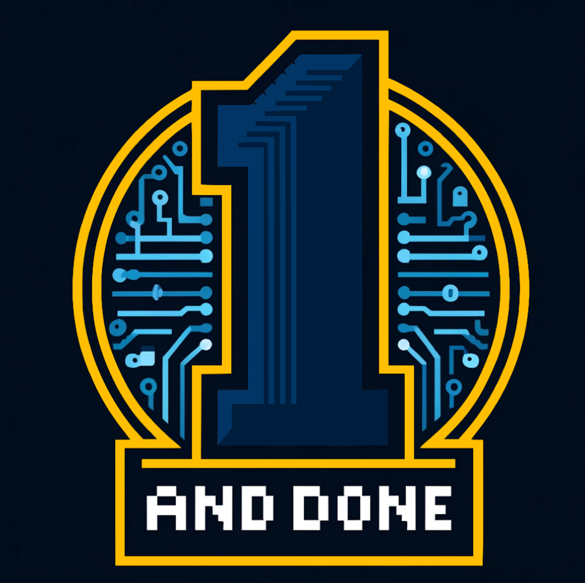

# One and Done

Welcome to **One and Done**, a feature-rich journal app built with HTML, CSS, and JavaScript. This app allows you to create notes and folders, use markdown for formatting, and manage tasks efficiently.

## Learn More About our [Team](admin/team.md)!

## Features

  - Create notes and folders
  - Markdown capability for notes
  - Task list management
  - Dark mode/light mode theme
  - Local Storage for data management

## Project Links

- We used Github for project management. Our [GitHub Repository](https://github.com/cse110-sp24-group1/cse110-sp24-group1) has our source code, meeting notes, brainstorming information, kanban board, and much more.
- We are hosting our [website](https://cse110-sp24-group1.github.io/cse110-sp24-group1/src/) with GitHub Pages.

## Brainstorming and Design Process

- We used [Dribble](https://dribbble.com/tags/journal-app) for inspiration for our journal app.
- We used [Miro](https://miro.com/app/board/uXjVKSW94aI=/) for our brainstorming and wireframing process.
- We used Figma for [wireframing](https://www.figma.com/design/VSgkp9TLpiEXWHehsFP2Dg/Team-1-App-Wireframing?node-id=0-1&t=2TFJMbA5jlGBypO5-0) and [hi-fidelity](ADD LINK) diagrams.

## SimpleMDE API

- We used [SimpleMDE's API](https://simplemde.com/) to implement a markdown editor which includes a tool bar and keyboard shortcuts.

  - **Bold**: `Cmd-B`
  - **Italic**: `Cmd-I`
  - **Link**: `Cmd-K`
  - **Preview**: `Cmd-P`
  - **Unordered List**: `Cmd-L`
  - **Code Block**: `Cmd-Alt-C`
  - **Image**: `Cmd-Alt-I`
  - **Ordered List**: `Cmd-Alt-L`
  - **Heading Bigger**: `Shift-Cmd-H`
  - **Heading Smaller**: `Cmd-H`
  - **Side By Side**: `F9`
  - **Full Screen**: `F11`

## CI/CD Pipeline

Our project uses GitHub Actions for Continuous Integration and Deployment. The pipeline includes:

### JSDoc

- We use JSDoc(ADD LINK) to generate our project documentation from JavaScript Comments. 

### Superlinter

- To ensure code quality and adherence to best practices.

### Jest and Puppeteer

- For testing purposes.
- (EXPLAIN HOW TO TEST)

## Repository Organization

- `/admin/meetings`: Contains our meeting notes.
- `/admin/cipipline`: Contains pipeline diagrams.
- `/admin/branding`: Continas branding information.
- `/admin/videos`: Contains progress videos.
- `/admin/guidelines`: Contains code style, version control, and CSS style guidelines
- `/docs`: Contains JSDoc information.
- `/specs/adrs`: Contains Architectural Design Records for any major decisions made in our project.
- `/specs/brainstorm`: Contains all of our initial brainstorming from user reasearch to wireframing.
- `/specs/pitch`: Contains our intial project pitch.
- `/src`: Contains source code for our project.
