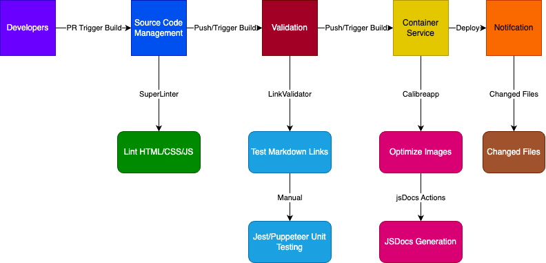

## CI Pipeline Status

The pipelines that will be used are currently 5 workflows. A link validator for markdown files, an automated JsDocs generator for all files with code comments that link to an html page. A linting manager that covers almost every language, but for the scope of our project, HTML, CSS, and JS. A file checker that comments on all files that are changed within the main branch, and an image optimizer for all files that contain images to save space. The 5 combinations of these workflows help streamline the pipeline process from push to deploy, while allowing the developers some freedom and not intruding on their productivty. Many of these implemenations imporve quality of life and help catch any important details that may be overlooked. There are plans to implement more workflows as we progress through the development of our project, and current integrations will be further fine-tuned for maximum efficiency. Below will explain the task of each workflow and its goal for our project.  

First is an automated link validator for all Markdown files in the repo. The goal of this workflow is to ensure that for links containing crucial information are not loss for documentation purposes. We hope to have this simple but effective workflow to ensure that mistakes are not overlooked, and links can be fixed in a reasonable time.  

Secondly, we have an image optimizer. This is especially important as since image inputs are a key feature of our journaling process, we do not strain the hardware of our users, and thus making the files more compressed in size while maintaining visually identical image quality. As we continue to scale and stress-test our functions, this will already be in place, crunching away at pngs, jpgs, etc, while further improving our website performance.  

Third, we are utilizing JSDocs for much of our documentation for our functions and classes. With the ability to automate this task, it will greatly improve efficiency of our documentaiton efforts, and constantly ensure that other developers can access the documentation with the ease of one button to get familiar with the implementation of others. This not only gives us an upper hand in task hand-off efficiency, but also benefit us in the deployment stage of our project, where users can read and understand the methods used to build the project.  

Fourth, we have a crucial workflow that will hopefully improve the code quality and orgnaization of our source files. The use of a linting service, specfically Superlinter is built in a manner where it can support a wide range of coding langauges. For our scope, it will primarily target Markdown, Javascript, CSS, and HTML within important directories like the **src** where most scripting files will be held. Instead of manually reviewing all the codes are running into the problems of confusing coding patterns, the linting will hopefully enforce the rules that are held by professional standards from the moment code is pushed. Due to its wide range of configurating, it can be fine tuned to our team's needs while ensuring that no one is slowed down.  

Fifth and last, we have a simple notication workflow that will keep track of files in the main/master branch, and notify any commits of what changes have been removed/added to the files. While we may have control and the ability to backtrack in our respective feature branches, it may be critical that we are able to track every change in our main branch as that is the branch that will be used for deployment. This way, we easily track any changes and take proper precautions as needed. We hope that simple but effective implementation will keep the team updated and vigilant in our branch management efforts.  

In terms of functionality of these workflows, are all working and have been heavily tested for all types of purposes. Many of these workflows do not require npm packages, keeping the repo clean and resistant to package failures. There are plans to add more workflows as needed during the development phase, but for now, all of the tests are in stable and working condition and easily adaptable and maintainable. Planning for possible AI integration using CHATGPT to review PRS will be in discussion and considered as it may prove potential fruitful rewards.  

In terms of integral important plans for the pipeline, we hope to add unit testing through Jest/Puppeteer, this will be integrated within a week or so as we begin to code our project and have to conduct simple testing methods to ensure that core features are working. The system diagram will be updated as well. This will continue to grow and will become quickly ingrained to a certain extent across all files, not just respective to the front-end/back-end source files.

