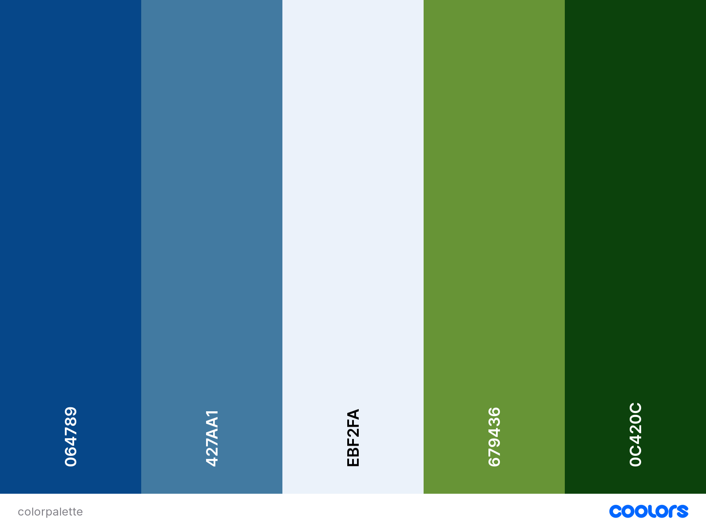
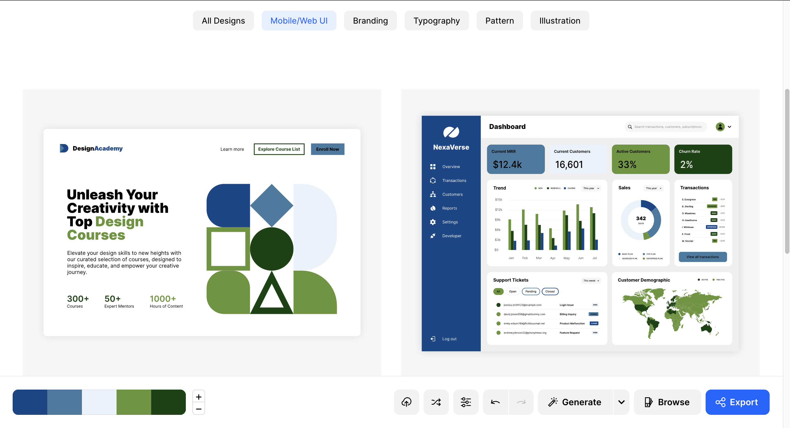

# One and Done
We are all aspiring software engineers!

## Values:
- **Collaboration:** We will learn and grow so much more as SWE by working together.
- **Honesty:** Builds trust.
- **Respect:** We value everyone's contributions and perspectives.
- **Inclusivity:** Diversity makes us stronger.
- **Communication:** Open and clear communication is important.

## Team Brand:
- **Icon:** 
- **Color Palette:** 
  
- **Vision** 
  
- **Theme:** Modern and Innovative

## Team Members:
- **[Purich Viwatkurkul](https://github.com/pviwatkurkul) - Leader/Developer**
  - Overview: .

- **[Anshi Singh](https://anshisinghh.github.io/Personal-Portfolio/) - Leader/Developer**
  - Hi! I'm a third-year computer science major. I am interested in both full-stack and back-end development, with experience in mobile app development as well.

- **[Vedant Mohan](https://github.com/VedantMohann) - Designer**
  - Overview:

- **[Pussakorn (Moss) Chanpanichravee](https://github.com/PussakornCH) - Designer** 
  - Overview: 

- **[Gwendolyn Wong](https://github.com/gewnwong) - Project Manager / Developer** 
  - Overview: 

- **[Kabir Vats](https://github.com/kabir-vats) - Developer** 
  - I am a second year computer engineering major. I like to walk around the empty office buildings near UTC on the weekends. 

- **[Katie Kim](https://github.com/katieki) - Developer** 
  - I’m a third year math-cs major, and I like watching modern family or true crime documentaries at 2x speed.

- **[Jeffrey Do](https://github.com/Doughster) - Developer** 
  - Overview: 

- **[Nam Nguyen](https://github.com/afacade) - Developer**
  - Overview:

- **[Jeremy Abondano](https://github.com/Jabo10) - Developer** 
  - Overview: 

- **[Theodore Van Berlo](https://github.com/TheodoreVB) - Developer**
  - Overview:
 
## Team Contract:
1. **Attendance:** Inform the team if unable to attend a meeting.
2. **Deadlines:** Notify the team in advance if unable to meet a deadline, propose a new deadline.
3. **Respect:** Respect all ideas and contributions.
4. **Communication:** Keep communication open and clear.
5. **Teamwork:** Help all team members regardless of role.
6. **Conflict Resolution:** Group project conflicts should be resolved by group vote. Personal conflicts should be resolved privately, with a leader as a mediator if needed.
